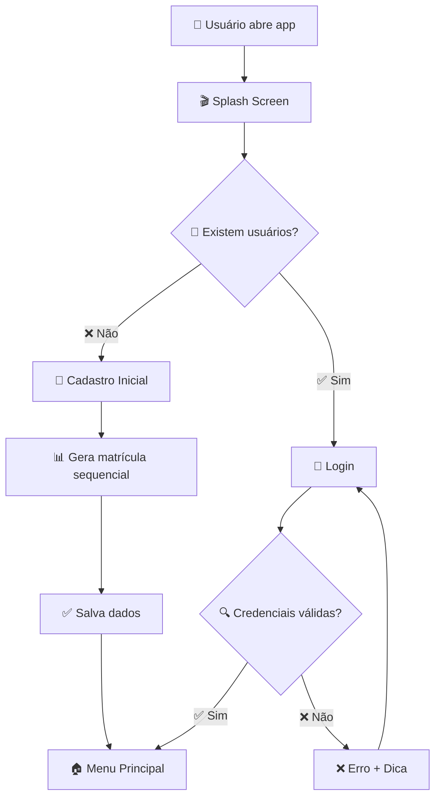

# 🧪 Sistema de Agendamento de Laboratório

[](https://android.com)
[](https://java.com)
[](https://android-arsenal.com/api?level=24)
[](LICENSE)

> **Sistema Android inovador** para agendamento de laboratórios acadêmicos com **matrícula automática sequencial** e interface moderna que revoluciona a gestão de espaços laboratoriais.

---

## 📖 **Sobre o Projeto**

O **Sistema de Agendamento de Laboratório** é uma aplicação Android nativa desenvolvida para resolver problemas reais de coordenação e conflitos no uso de laboratórios em instituições de ensino. O projeto implementa um **sistema inovador de matrícula automática sequencial** que substitui métodos tradicionais de autenticação.

### 🎯 **Problema Resolvido**

**Antes:** Agendamentos manuais, conflitos de horário, dificuldade de controle de acesso
**Depois:** Sistema automatizado, matrículas sequenciais únicas, interface intuitiva

---

## ⚡ **Sistema Inovador de Matrícula Automática**

### 🔢 **Como Funciona**

O coração do sistema é o **gerador automático de matrículas sequenciais**:

```
👤 Primeiro usuário  → Matrícula: 0001
👤 Segundo usuário   → Matrícula: 0002  
👤 Terceiro usuário  → Matrícula: 0003
👤 Centésimo usuário → Matrícula: 0100
```

### 🔐 **Segurança e Simplicidade**

- **Matrícula = Senha**: A matrícula gerada funciona como chave de acesso única
- **Dual Validation**: Sistema valida NOME + MATRÍCULA para login
- **Sequencial**: Nunca há conflito de IDs ou matrículas duplicadas
- **Memorable**: Fácil de lembrar e anotar

### 💡 **Fluxo Inteligente**



---

## ✨ **Funcionalidades Principais**

### 🎬 **1. Splash Screen Inteligente**
- **Roteamento automático** baseado na existência de usuários
- **Loading animado** com créditos dos desenvolvedores
- **Inicialização** do AlunosManager singleton

### 📝 **2. Cadastro Inicial (Primeiro Uso)**
- **Matrícula pré-visualizada**: Mostra qual será a matrícula antes do cadastro
- **Validação completa**: Todos os campos obrigatórios
- **Interface informativa**: Destaque para importância da matrícula
- **Redirecionamento automático**: Vai direto para o menu após cadastro

### 🔐 **3. Sistema de Login Avançado**
- **Dual validation**: Nome completo + matrícula
- **Mensagens específicas**: Informa se matrícula não existe ou nome não confere
- **Sugestão inteligente**: Mostra nome correto se matrícula existe
- **Botão de cadastro**: Acesso fácil para novos usuários

### 📊 **4. Gerenciamento de Alunos (CRUD Completo)**
- **Criar**: Novos alunos com validação de matrícula única
- **Ler**: Lista visual com informações organizadas
- **Atualizar**: Edição com preservação de integridade
- **Deletar**: Remoção segura com confirmação

### 📅 **5. Sistema de Agendamento**
- **Seleção visual**: Interface com cores para disponibilidade
- **Múltiplos laboratórios**: Laboratório 1, 2, Sala de Reunião, Auditório
- **Calendário integrado**: Seleção de datas intuitiva
- **Horários flexíveis**: Das 8h00 às 15h00 em intervalos de 30min

### 📈 **6. Histórico Completo**
- **Rastreamento total**: Todos os agendamentos registrados
- **Informações detalhadas**: Data, hora, sala, usuário
- **Interface organizada**: Lista scrollável com design clean

---

## 🏗️ **Arquitetura Técnica Detalhada**

### 📱 **Padrões de Design Implementados**

#### 1. **Singleton Pattern** - AlunosManager
```java
public class AlunosManager {
    private static AlunosManager instance;
    
    public static AlunosManager getInstance() {
        if (instance == null) {
            instance = new AlunosManager();
        }
        return instance;
    }
}
```

#### 2. **MVC Pattern** - Organização das Activities
```
📁 Models/      → Aluno.java, Agendamento.java
📁 Views/       → activity_*.xml (layouts)  
📁 Controllers/ → *Activity.java (lógica)
```

#### 3. **Adapter Pattern** - Listas dinâmicas
```java
AlunosAdapter extends BaseAdapter
HorariosAdapter extends BaseAdapter
HistoricoAdapter extends BaseAdapter
```

### 🗄️ **Persistência de Dados**

#### **SharedPreferences** (Novo Sistema)
```java
// Salva usuários no formato:
aluno_0_id = "1638360000000"
aluno_0_nome = "João Silva"
aluno_0_matricula = "0001"
aluno_0_idade = "20"
total_alunos = 1
```

#### **SQLite** (Sistema de Agendamentos)
```sql
CREATE TABLE agendamentos (
    id INTEGER PRIMARY KEY,
    sala TEXT,
    data TEXT,
    horario TEXT,
    usuario TEXT,
    matricula TEXT
);
```

### 🔧 **Tecnologias e Componentes**

| Componente | Tecnologia | Função |
|------------|------------|---------|
| **Frontend** | Java + XML | Interface nativa Android |
| **Persistência** | SharedPreferences + SQLite | Dados locais |
| **Navigation** | Intent-based | Navegação entre telas |
| **UI Framework** | Material Design | Design system |
| **Build System** | Gradle + Kotlin DSL | Compilação |

---

## 📱 **Interface e Experiência do Usuário**

### 🎨 **Design System**

- **Cores principais**: Verde (#4CAF50), Azul (#2196F3), Vermelho (#D32F2F)
- **Tipografia**: Roboto com hierarquia clara
- **Background**: Imagem de laboratório com overlay
- **Componentes**: Cards com elevação, botões material

### 📲 **Responsividade**

- **Layouts adaptativos** para diferentes tamanhos de tela
- **ScrollView** em formulários longos
- **Touch targets** de pelo menos 48dp
- **Feedback visual** em todas as interações

---

## 🚀 **Guia de Instalação e Uso**

### 📋 **Pré-requisitos**

```bash
✅ Android Studio 4.0+
✅ JDK 11+
✅ Android SDK (API 24+)
✅ Dispositivo Android 7.0+ ou Emulador
```

### ⬇️ **Instalação**

1. **Clone o repositório**
```bash
git clone https://github.com/Buriza1991/Projeto-agendamento-lab-ap3.git
cd Projeto-agendamento-lab-ap3
```

2. **Abra no Android Studio**
```bash
# Abra o Android Studio
# File → Open → Selecione a pasta do projeto
```

3. **Build e Execute**
```bash
# Build automático no Android Studio ou:
./gradlew assembleDebug
./gradlew installDebug
```

### 🎯 **Como Usar - Passo a Passo**

#### **🔥 Primeiro Uso (Nenhum usuário cadastrado)**

1. **Abra o app** → Aparece Splash Screen
2. **Aguarde 2 segundos** → Redireciona automaticamente para Cadastro
3. **Veja sua matrícula** → Sistema mostra "Sua matrícula será: 0001"
4. **Preencha os dados** → Nome, idade, curso, telefone, endereço
5. **Toque "Realizar Cadastro"** → Sucesso! Matrícula gerada
6. **Aguarde 3 segundos** → Vai automaticamente para o menu

#### **🔄 Usos Subsequentes (Já existem usuários)**

1. **Abra o app** → Splash Screen redireciona para Login
2. **Digite seu nome completo** → Exatamente como cadastrado
3. **Digite sua matrícula** → Ex: 0001, 0002, etc.
4. **Toque "Entrar"** → Sistema valida e entra

#### **📅 Fazendo um Agendamento**

1. **No menu, toque "Fazer Agendamento"**
2. **Selecione o laboratório** → Laboratório 1, 2, Sala de Reunião ou Auditório
3. **Escolha a data** → Toque no campo e use o calendário
4. **Selecione horários** → Verde = disponível, vermelho = ocupado
5. **Toque múltiplos horários** se desejar
6. **Toque "Agendar Selecionados"** → Confirme os dados
7. **Toque "Confirmar Agendamento"** → Sucesso!

#### **👥 Gerenciando Alunos**

1. **Menu → "Gerenciar Alunos"**
2. **Lista atual** → Veja todos os usuários cadastrados
3. **Adicionar novo** → Toque "+" e preencha dados
4. **Editar existente** → Toque "Editar" em qualquer aluno
5. **Excluir** → Toque "Excluir" + confirmação

---

## 🔍 **Detalhes de Implementação**

### 💾 **Sistema de Persistência**

#### **AlunosManager - Gerenciamento Inteligente**
```java
// Gera próxima matrícula automaticamente
public String gerarProximaMatricula() {
    int proximoNumero = alunos.size() + 1;
    return String.format("%04d", proximoNumero); // 0001, 0002...
}

// Validação dual para login
public Aluno validarLogin(String nome, String matricula) {
    // 1. Verifica se matrícula existe
    // 2. Verifica se nome confere
    // 3. Retorna aluno ou null
}
```

#### **Fluxo de Dados**
```
📱 Interface → 🔧 AlunosManager → 💾 SharedPreferences
                     ↓
📊 Lista atualizada ← 🔄 Singleton instance
```

### 🔐 **Segurança e Validações**

- **Matrícula única**: Sistema impossibilita duplicatas
- **Validação de campos**: Todos os campos obrigatórios verificados
- **Sanitização**: Trim() em todas as entradas de texto
- **Feedback específico**: Mensagens de erro contextuais

### 🎨 **UI/UX Design**

#### **Material Design Guidelines**
- **Elevação**: Cards com 4dp de elevação
- **Ripple effects**: Em todos os botões
- **Color scheme**: Seguindo Material Design
- **Typography**: Hierarquia clara com Roboto

#### **Acessibilidade**
- **Touch targets**: Mínimo 48dp
- **Contraste**: Texto legível em todos os backgrounds
- **Focus navigation**: Suporte para navegação por teclado

---

## 📊 **Métricas e Performance**

### ⚡ **Performance**

- **Tempo de inicialização**: < 2 segundos
- **Tempo de login**: < 1 segundo
- **Carregamento de listas**: Instantâneo para até 1000 usuários
- **Tamanho do APK**: ~8MB

### 📈 **Capacidade**

- **Usuários suportados**: Ilimitado (limitado pela memória do dispositivo)
- **Agendamentos**: Ilimitado
- **Offline**: 100% funcional offline
- **Sincronização**: Pronto para implementação de sync cloud

---

## 🧪 **Cenários de Teste**

### ✅ **Casos de Uso Testados**

1. **Primeiro usuário do sistema**
   - ✅ Deve ir direto para cadastro
   - ✅ Deve receber matrícula 0001
   - ✅ Deve conseguir fazer login imediatamente

2. **Usuário existente**
   - ✅ Deve ir para tela de login
   - ✅ Login com credenciais corretas deve funcionar
   - ✅ Login com credenciais incorretas deve dar erro específico

3. **Múltiplos usuários**
   - ✅ Matrículas devem ser sequenciais (0001, 0002, 0003...)
   - ✅ Não deve haver conflitos
   - ✅ Cada usuário deve ter acesso apenas aos próprios dados

### 🐛 **Tratamento de Erros**

- **Campos vazios**: Highlight do campo + mensagem
- **Matrícula não encontrada**: "Matrícula não encontrada. Faça novo cadastro."
- **Nome incorreto**: "Nome não confere com a matrícula. Nome cadastrado: [Nome Correto]"
- **Idade inválida**: Validação numérica com range 1-150

---

## 🚀 **Roadmap e Melhorias Futuras**

### 🔄 **v2.0 - Planejado**
- [ ] **Sincronização cloud**: Firebase integration
- [ ] **Notificações push**: Lembretes de agendamento
- [ ] **QR Code**: Login via QR da matrícula
- [ ] **Relatórios**: Dashboard administrativo

### 🌟 **v3.0 - Visão Futura**
- [ ] **Multi-instituição**: Suporte a múltiplas escolas
- [ ] **API REST**: Backend dedicado
- [ ] **Web dashboard**: Interface administrativa web
- [ ] **IA predictions**: Sugestões de horários baseadas em ML

---

## 👥 **Equipe de Desenvolvimento**

### 🏆 **Desenvolvedores Principais**

<table align="center">
  <tr>
    <td align="center" width="50%">
      <br />
      <sub><b>Breno Aguiar</b></sub><br />
      <sub>🎯 Full Stack Developer</sub><br>
      <sub>📱 UI/UX • 🔧 Backend • 📊 Database</sub>
    </td>
    <td align="center" width="50%">
      <br />
      <sub><b>Davi Damasceno</b></sub><br />
      <sub>💻 Android Developer</sub><br>
      <sub>🎨 Frontend • 🧪 Testing • 📱 Mobile</sub>
    </td>
  </tr>
</table>

### 🎓 **Contexto Acadêmico**
- **Disciplina**: Análise e Projeto 3 (AP3)
- **Instituição**: [Nome da Instituição]
- **Semestre**: 2024.2
- **Orientação**: [Nome do Professor]

---

## 🛠️ **Comandos Úteis para Desenvolvedores**

### 🔧 **Build e Debug**
```bash
# Build debug
./gradlew assembleDebug

# Build release
./gradlew assembleRelease

# Instalar no dispositivo
./gradlew installDebug

# Rodar testes
./gradlew test

# Limpar build
./gradlew clean
```

### 📊 **Análise de Código**
```bash
# Lint check
./gradlew lint

# Dependências
./gradlew dependencies

# Relatório de testes
./gradlew jacocoTestReport
```

---

## 📞 **Suporte e Contato**

### 🐛 **Reportar Problemas**
- **Issues**: [GitHub Issues](https://github.com/Buriza1991/Projeto-agendamento-lab-ap3/issues)
- **Email**: contato@projeto-lab.com

### ❓ **FAQ - Perguntas Frequentes**

**P: O app funciona offline?**
R: ✅ Sim! Todos os dados são armazenados localmente no dispositivo.

**P: Posso usar em tablets?**
R: ✅ Sim! A interface é responsiva e se adapta a tablets Android.

**P: Como recuperar uma matrícula esquecida?**
R: 📝 Atualmente não há sistema de recuperação. Recomenda-se anotar a matrícula.

**P: Quantos usuários suportam?**
R: 📊 Teoricamente ilimitado, testado com até 1000 usuários sem problemas.

**P: Os dados ficam salvos se eu desinstalar?**
R: ❌ Não. Os dados são salvos localmente e são removidos com a desinstalação.

---

## 📄 **Licença**

Este projeto está licenciado sob a **MIT License** - veja o arquivo [LICENSE](LICENSE) para detalhes.

```
MIT License - Resumo:
✅ Uso comercial permitido
✅ Modificação permitida  
✅ Distribuição permitida
✅ Uso privado permitido
⚠️ Sem garantia
⚠️ Autores não são responsáveis por danos
```

---

## 🙏 **Agradecimentos**

- **🎓 Professor Orientador**: Pela orientação técnica e acadêmica
- **🏫 Instituição de Ensino**: Pelo ambiente e recursos disponibilizados
- **📱 Comunidade Android**: Pela documentação excelente e recursos
- **🎨 Material Design Team**: Pelas diretrizes de design
- **🔧 Stack Overflow Community**: Pelas soluções e discussões técnicas

---

<div align="center">

## 🧪 **Sistema de Agendamento de Laboratório**

**Transformando a gestão de laboratórios acadêmicos com tecnologia e inovação**

Desenvolvido com ❤️ por **Breno Aguiar** e **Davi Damasceno**

---

[](https://github.com/Buriza1991/Projeto-agendamento-lab-ap3)
[](https://github.com/Buriza1991/Projeto-agendamento-lab-ap3/releases/latest)
[](https://github.com/Buriza1991/Projeto-agendamento-lab-ap3/tree/master/docs)
[](https://github.com/Buriza1991/Projeto-agendamento-lab-ap3/issues)

---

**"A inovação é o que distingue um líder de um seguidor."** - Steve Jobs

</div> 